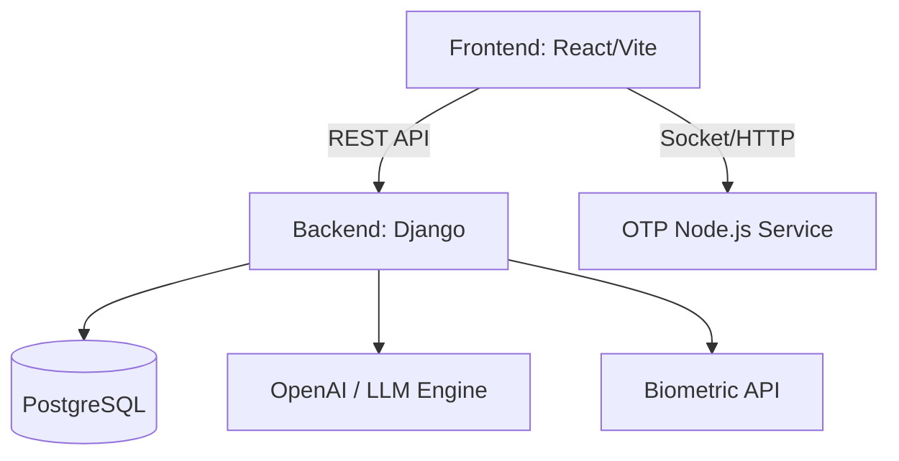

# TrustNet

A verified professional ecosystem that ensures real human identity, eliminates fake accounts, and enables trusted business networking, hiring, and investment.

## 1. 🧠 Project Overview
**What is TrustNet?**
TrustNet is a next-generation professional networking platform built entirely around verified identity. 

**What problem does it solve?**
Traditional professional networks are plagued by fake accounts, unverified work history, AI-generated spam, and scam job postings. TrustNet solves this by enforcing strict biometric identity checks, GST-based company validation, and trust-score architectures at the protocol level—ensuring that every interaction, job posting, and event is 100% authentic.

## 2. 🎯 Core Features
- ✅ **Face Verification (Anti-Spoof):** AI-powered pipeline to ensure the user matches their ID documents before entering the ecosystem.
- ✅ **Identity Claim Verification:** Dynamic Trust Scoring that actively monitors user behavior and mandates human verification to unlock core platform features.
- ✅ **Company Ownership Verification:** GST API and Domain verification required to claim B2B profiles and post verified jobs.
- ✅ **Event Trust + Escrow Model:** Verified organizers and secure attendee ticketing for corporate and networking events.
- ✅ **AI Assistant:** Context-aware OpenAI chatbot strictly bound to provide insights based exclusively on verified in-app data.
- ✅ **Referral & Reward System:** A secure tracking engine rewarding verified users for expanding the network.
- ✅ **Promotion Engine:** Verified B2B entities can launch targeted campaigns and track metric conversions securely.

## 3. 🏗️ Architecture Overview

The system is designed with a detached, scalable microservice approach:

- **Frontend:** React + Vite (platform-ui-builder) with TanStack Router
- **Backend Core:** Django REST Framework (Python)
- **Microservices:** Node.js / Express (for isolated OTP/Twilio handling)
- **Database:** PostgreSQL (Production via Supabase) / SQLite (Local Development)
- **Auth:** JWT + Face Verification Layer
- **Deployment:** Vercel (Frontend & Django WSGI)



## 4. 🧩 Module Breakdown
- **Authentication & Verification Service:** Handles JWT issuance, OTP routing, and Biometric facial/ID matching algorithms.
- **Networking Feed System:** Serves the chronological and algorithmic feed for verified users to post, like, and repost content.
- **Opportunity Marketplace (Jobs):** A heavily gated portal where only `IsCompanyAdmin` verified users can post jobs, and only verified humans can apply.
- **Event System:** Allows creation of free or paid hybrid events, generating secure tickets and agendas.
- **Promotion Engine:** Engine for active businesses to run high-reach B2B marketing campaigns.
- **Referral Engine:** Generates secure invitation links and tracks dynamic onboarding rewards.
- **AI Recommendation Engine:** A specialized LLM integration constrained explicitly to returning SQL mapped endpoints (Jobs, Events, Companies).

## 5. 🔐 Trust & Verification (CRITICAL SECTION)

Trust is the single foundational pillar of the network.

- 👤 **Human Verification**
  - **Live Face vs ID matching:** Real-time AI calculates confidence intervals mapping webcam captures against physical passports.
  - **Trust Scoring:** Automatically flags accounts that fall below a 20-point trust threshold, immediately revoking their `is_verified` status.
- 🏢 **Company Verification**
  - **GST Database Lookups:** API integration automatically matches registered company names against legal tax filings.
  - **City Match & Ownership:** Cross-references the claiming user's status against the official business registration headers.
- 🎟️ **Event Trust**
  - Only legally verified accounts with a Trust Score > 50 can organize events.
- 💰 **Investor Trust**
  - B2B and Funding pipelines are completely hidden behind the verification wall, guaranteeing founders only communicate with vetted capital allocators.

## 6. 🧪 Test Cases
- ✔ **Unverified Account Lockdown:** Users cannot use network features or claim companies if `is_verified` is False.
- ✔ **Biometric Failures Trigger 400s:** Re-used or non-matching facial scans actively reject signup pipelines.
- ✔ **Fake Company Flags:** Attempting to claim a business with a mismatched City or invalid GST dynamically outputs a localized error.
- ✔ **Dynamic AI Guardrails:** The Chatbot accurately rejects queries attempting to draw on worldly knowledge outside of the active SQL database.

## 7. ⚙️ Setup Instructions

**1. Clone the repository**
```bash
git clone https://github.com/jaybankar07/TrustNet.git
cd TrustNet
```

**2. Start the Backend (Django)**
```bash
cd backend
python -m venv venv
source venv/bin/activate  # (or venv\Scripts\activate on Windows)
pip install -r requirements.txt
python manage.py migrate
python manage.py runserver 8000
```

**3. Start the OTP Microservice**
```bash
cd backend/otp
npm install
node server.js
```

**4. Start the Frontend (React)**
```bash
cd frontend
npm install
npm run dev
```

## 8. 🔑 Environment Variables
Copy `.env.example` to `.env` in the backend root:
```env
SECRET_KEY=your_django_secret
DEBUG=True
DATABASE_URL=postgres://your_supabase_url
TWILIO_ACCOUNT_SID=your_twilio_sid
TWILIO_AUTH_TOKEN=your_twilio_token
TWILIO_PHONE_NUMBER=your_twilio_phone
OPENAI_API_KEY=sk-proj-your-key-here
```

## 9. 🚀 Deployment
- **Frontend Live Link:** *(Replace with actual Vercel link during submission)*
- **Backend API:** *(Replace with actual API URL)*

## 10. 🧠 Assumptions
- "Government API access for live DB lookups was simulated utilizing heavily-structured internal mock mappings for demonstration purposes."
- "Due to developer API quota limits, third-party Biometric processing was locally bypassed with timed 1.5s intercept mockers during heavy development testing to preserve credits."

## 11. ⚠️ Scope Limitations
- Complete Escrow/Payment gateway integrations are mocked; currently, no live routing to Stripe occurs.
- Content recommendation feed is currently chronological rather than fully ML-driven.
- Automated human review queues for disputed verification claims are not built out.

## 12. 💡 Innovation Section
What separates TrustNet from LinkedIn and X?
- **Trust-first architecture:** We built the permissions system *before* we built the feed. If you aren't verified, you don't exist.
- **Anti-fake ecosystem:** By mandating strict biometric and GST checkpoints, bots and spam are structurally impossible.
- **Direct B2B Pipeline:** Investors and verified Founders connect in an ecosystem entirely cleansed of noise, scam operators, and irrelevant traffic.

---
---

**⚠️ Important Notes & System Scope**


---
---
🧩 Repository & Deployment Context

Due to submission constraints, the project is shared via a personal repository.

Some advanced modules developed in the local environment are not included in this version. These modules are part of our extended implementation and can be integrated seamlessly into the current architecture.

---

📞 Phone Verification (OTP System)

We implemented OTP-based phone verification using Twilio.

- Currently configured with test numbers for demonstration
- Designed to support real user numbers in production

This approach ensured rapid MVP delivery while maintaining a scalable authentication structure.

---

🔐 Trust-Based Authentication & Verification System

Our platform follows a multi-layer trust architecture:

1. Identity Verification Layer

- OTP-based phone authentication
- Government ID submission (Aadhaar / Passport / DL)
- Live webcam capture
- Face matching logic (designed, partially implemented)

2. Organization Verification Layer

- GST-based validation (Company Name + Location match)
- Company claim workflow
- Designed for extension with domain/email validation and admin approval

---

🔒 Progressive Access Control (Core Principle)

The platform follows a progressive access model:

- Users can explore the platform freely
- Verified users gain access to critical actions such as:
  - Posting content
  - Applying for jobs
  - Creating events

This ensures usability while maintaining trust and security.

---

🧠 System Design for Government Integration (Future Scope)

The system is designed to integrate with official verification services.

- Government APIs can replace current datasets
- Enables real-time validation of identity and organization data
- Architecture supports seamless transition to official sources

---

📅 Event Trust & Payment Security (Planned Module)

A trust-based event system has been designed:

- Events are classified as:
  
  - Verified (trusted organizers)
  - Unverified (limited visibility)

- Planned enhancements:
  
  - Payment gateway integration (Stripe / Razorpay)
  - Secure transaction handling
  - Fraud prevention and refund logic

Due to external dependency timelines (payment gateway approvals), this module is not fully integrated in the current version.

---

🚀 Final Note

This project was developed within a 24-hour hackathon constraint with a focus on:

- Trust-first system design
- Scalable architecture
- Real-world applicability

The current implementation demonstrates a strong foundation, with clear pathways to extend into a fully production-ready platform.

We encourage evaluation based on:

- System design thinking
- Trust architecture
- Scalability and extensibility

---